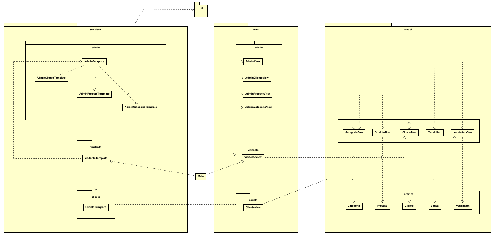
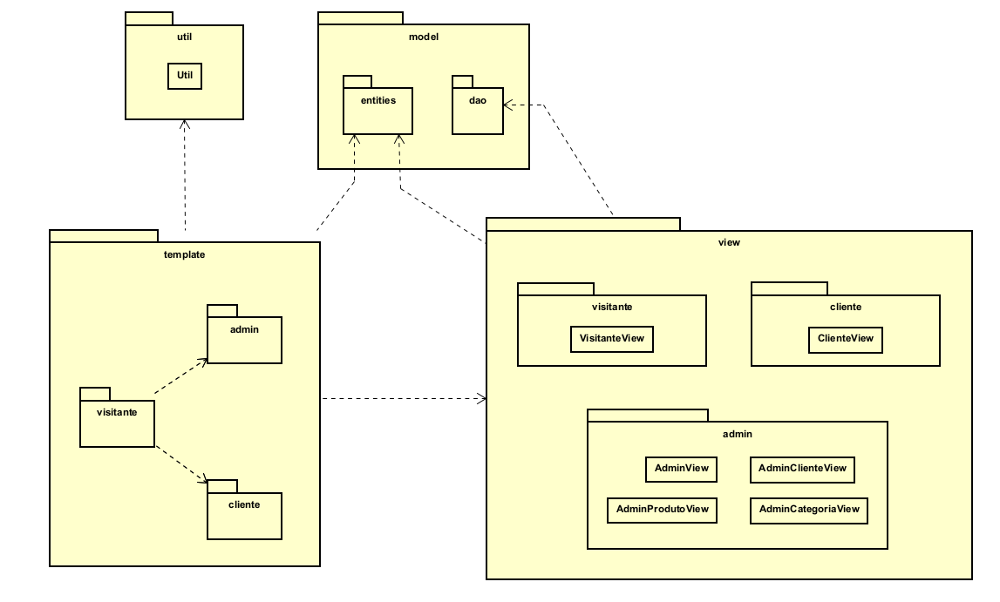
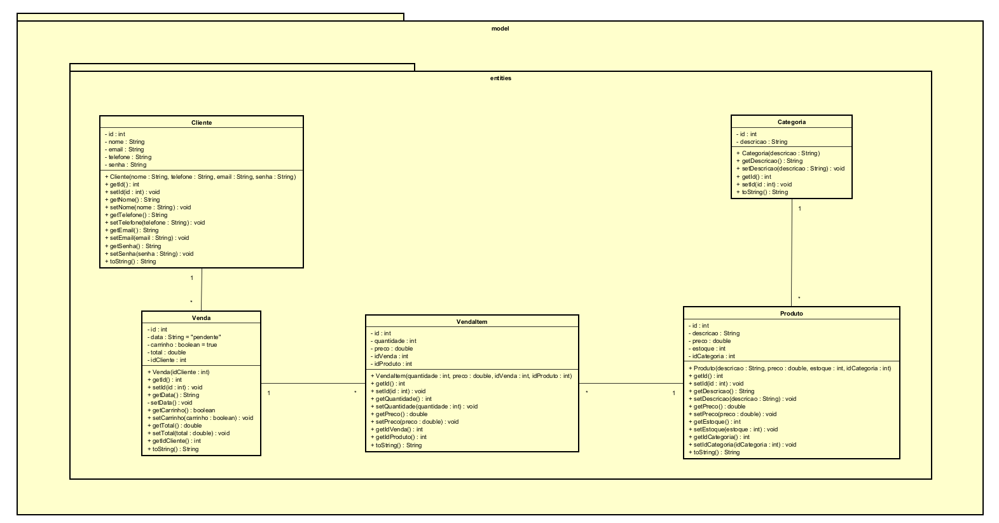
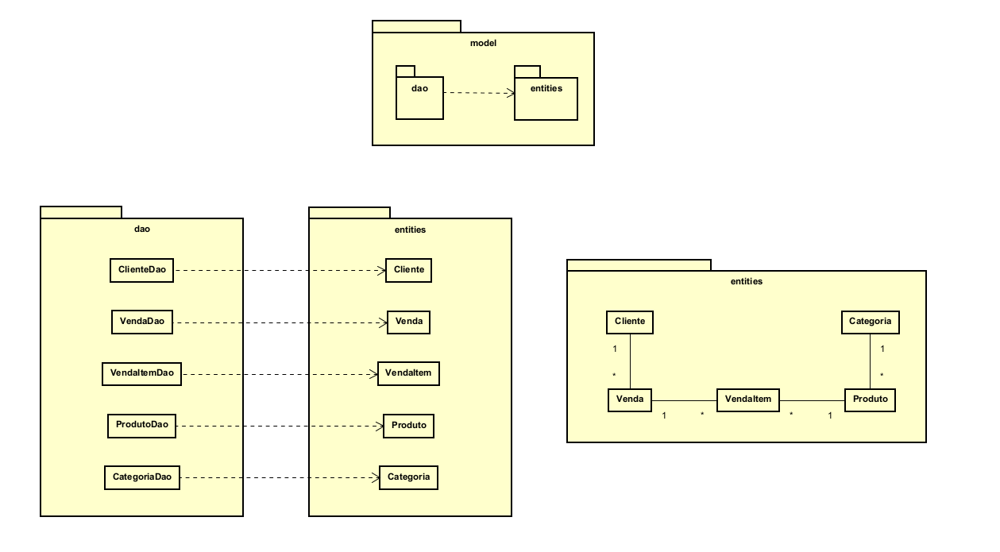
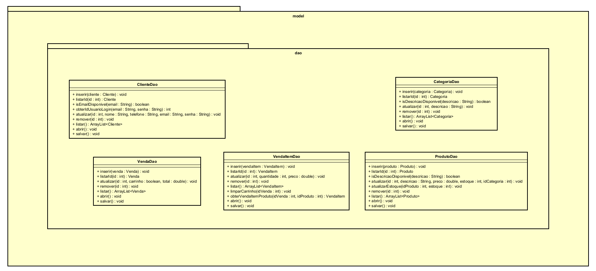
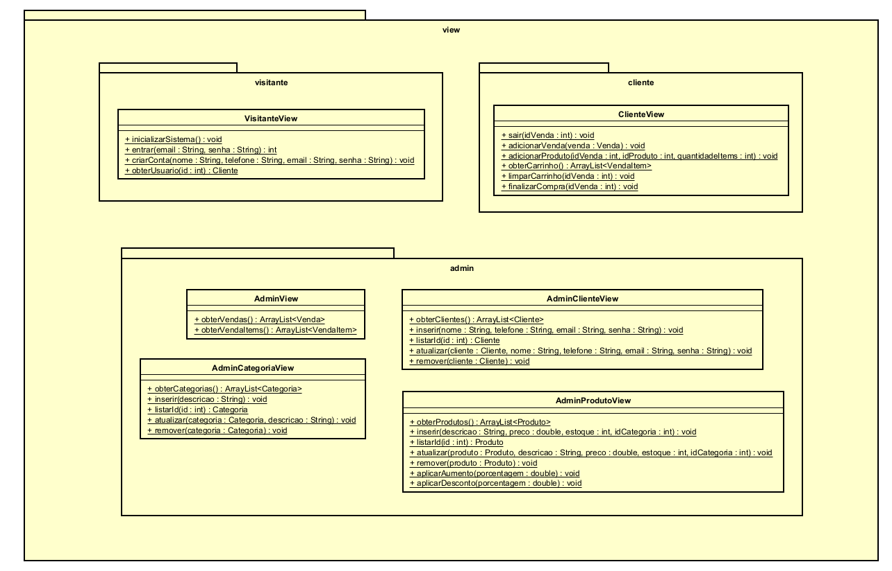
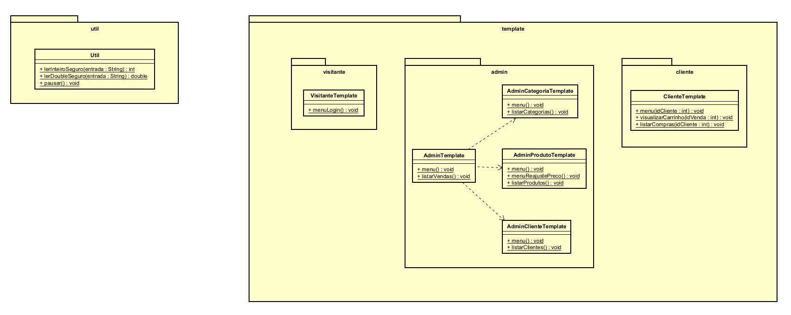

# 🛒 Sistema de Comércio Eletrônico - Java Console App

Este é um Sistema de Comércio Eletrônico desenvolvido em Java, funcionando inteiramente via terminal (console). O projeto implementa uma separação rigorosa de responsabilidades através de uma arquitetura baseada em camadas, garantindo código limpo, manutenibilidade e persistência de dados utilizando arquivos JSON.

O sistema foi projetado para atender a dois perfis distintos de usuários: **Administradores** e **Clientes**, com fluxos de navegação e permissões de acesso independentes.

## ✨ Funcionalidades Principais

**Segurança e Inicialização:**
* **Autenticação:** Sistema de login para usuários cadastrados.
* **Bootstrap:** Geração automática do usuário Administrador mestre e da estrutura de arquivos na primeira execução.
* **Validação Fail-Fast:** Proteção nas Entidades via encapsulamento, impedindo estados inválidos (estoque negativo, e-mail duplicado ou campos vazios).

**Painel do Administrador:**
* **Gestão Completa (CRUD):** Controle total sobre Clientes, Categorias e Produtos.
* **Gestão de Preços:** Ferramenta para aplicação de reajustes (aumentos ou descontos) em lote por porcentagem.
* **Auditoria:** Listagem global de todas as vendas e itens comercializados na plataforma.

**Área do Cliente:**
* **Vitrine Virtual:** Listagem de produtos com informações em tempo real.
* **Carrinho Inteligente:** Agrupamento automático de itens e cálculo dinâmico de subtotais.
* **Gestão de Sessão:** Limpeza automática de carrinhos e vendas não finalizadas para garantir a integridade dos dados (limpeza de "lixo" no JSON).
* **Histórico:** Acesso detalhado a compras concluídas, incluindo data, total e categorias dos produtos.

## 🏗️ Arquitetura do Sistema (MVT)

O projeto utiliza uma adaptação do padrão **Model-View-Template**, isolando a lógica de persistência, as regras de negócio e a interface de usuário.



**Divisão de Camadas:**

1. **Model (Entities & DAO):** O núcleo de dados. As **Entities** contêm os dados e regras de validação interna. Os **DAOs** (Data Access Object) são responsáveis pela persistência atômica, realizando a leitura e gravação dos arquivos JSON via biblioteca Google GSON.
2. **View:** A camada de serviços e lógica de negócio. Atua como intermediária: recebe requisições, processa validações complexas (como cálculos de estoque e regras de unicidade) e devolve os resultados processados. **A View é independente da interface e não possui conhecimento da existência do Template.**
3. **Template:** O motor de navegação e interface (CLI). É a camada responsável por ditar o fluxo do sistema, capturar entradas do usuário, invocar os métodos da View e apresentar os dados ou mensagens de erro na tela.



## 📊 Diagramas de Classes (UML)

### Entidades do Banco de Dados
Mapeamento das classes de domínio e seus relacionamentos estruturais.


*Visão de dependências independentes do Model:*


### Camada de Persistência (DAO)
Interface de comunicação com os arquivos de dados.


### Camada de Negócio e Serviços (View)
Processamento lógico e intermediação de dados.


### Interface de Usuário e Utilitários (Template & Util)
Gerenciamento de menus e métodos auxiliares de entrada segura.


## 🚀 Tecnologias Utilizadas

* **Java (JDK 21+)**: Utilização de recursos modernos da linguagem e forte tipagem.
* **Google GSON**: Serialização e desserialização eficiente de objetos para JSON.
* **Astah Professional**: Modelagem técnica seguindo padrões UML.
* **Git & GitHub**: Versionamento de código com foco em *Semantic Commits*.

## 🛠️ Como Executar o Projeto

1. Clone este repositório:
   ```bash
   git clone https://github.com/maxwell-dantas/comercio-eletronico.git
2.  Importe o projeto em sua IDE (IntelliJ, Eclipse ou VS Code).
3.  Adicione a biblioteca **GSON** ao seu `classpath`.
4.  Execute a classe `Main.java` na raiz do pacote `comercioEletronico`.
5.  **Credenciais Iniciais:** O sistema cria um administrador padrão com login `admin` e senha `admin`.

## 👨‍💻 Autor e Contexto

Desenvolvido por **Maxwell Dantas**, estudante de Análise e Desenvolvimento de Sistemas no IFRN (Campus Natal Central, RN).

Este projeto foi construído sob a orientação do **Prof. Gilbert Azevedo da Silva** na disciplina de Programação Orientada a Objetos. O objetivo principal foi aplicar padrões de projeto robustos e garantir a integridade de dados em sistemas complexos.
