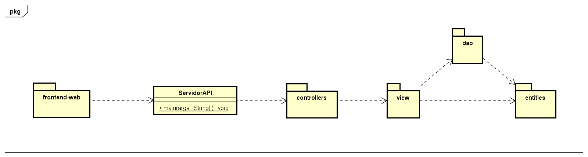
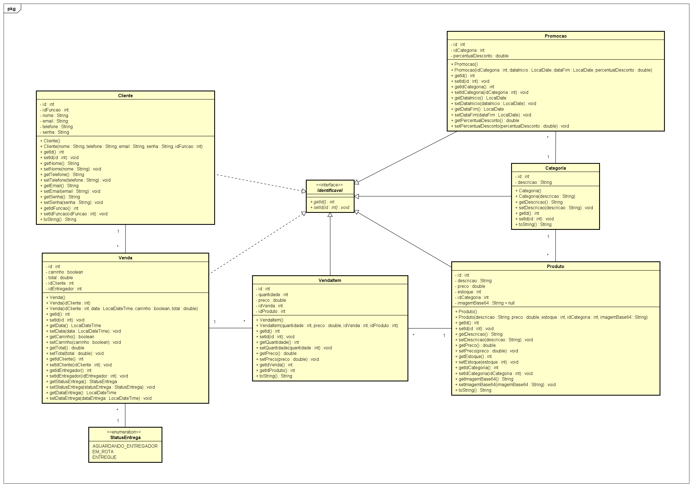
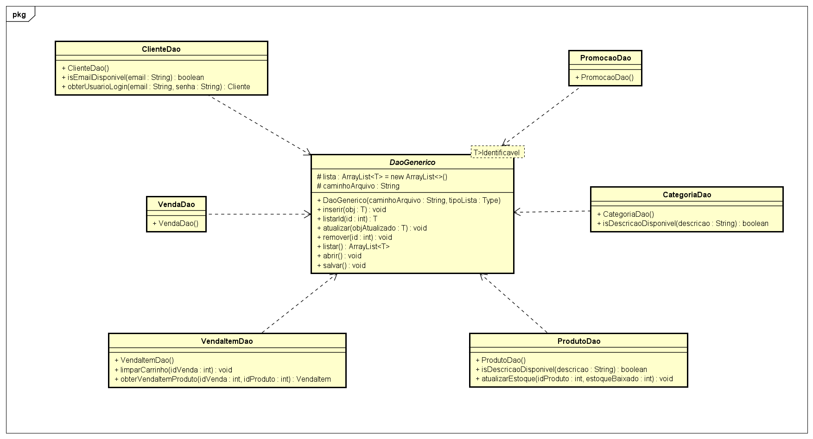
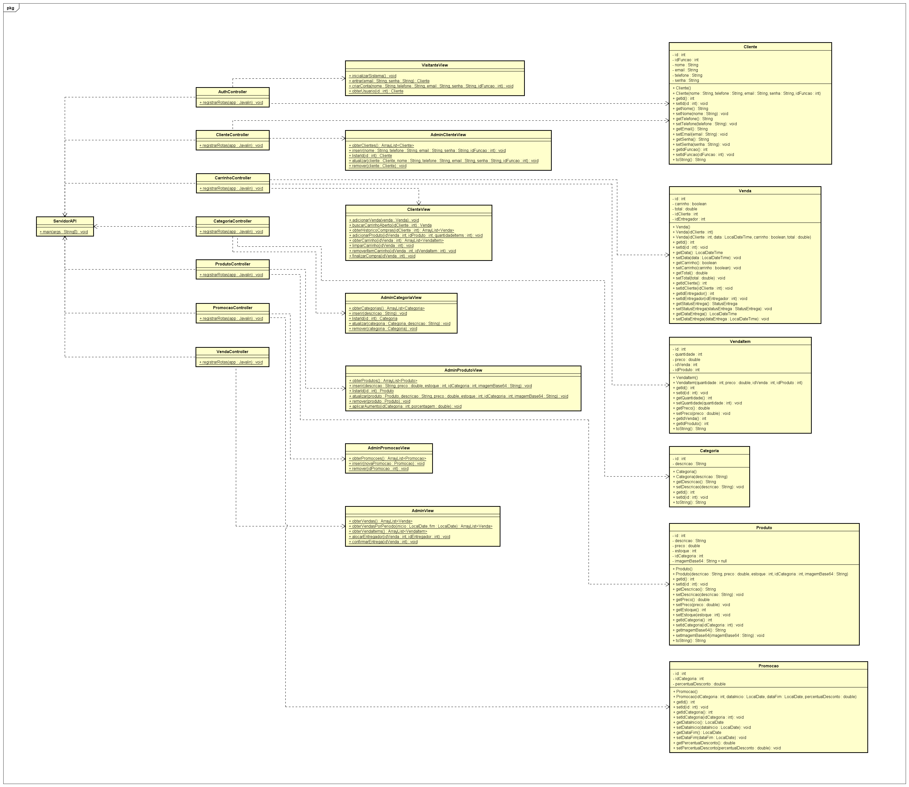
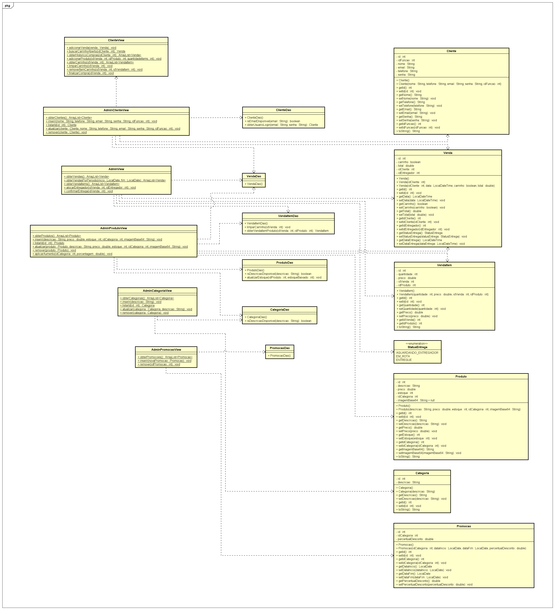
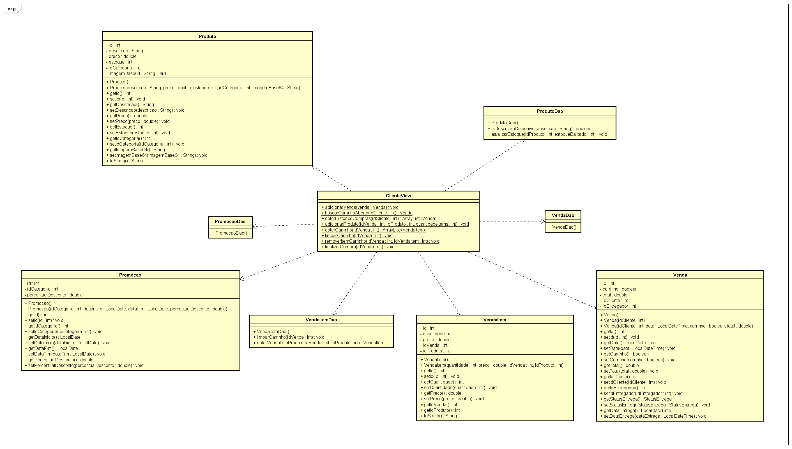
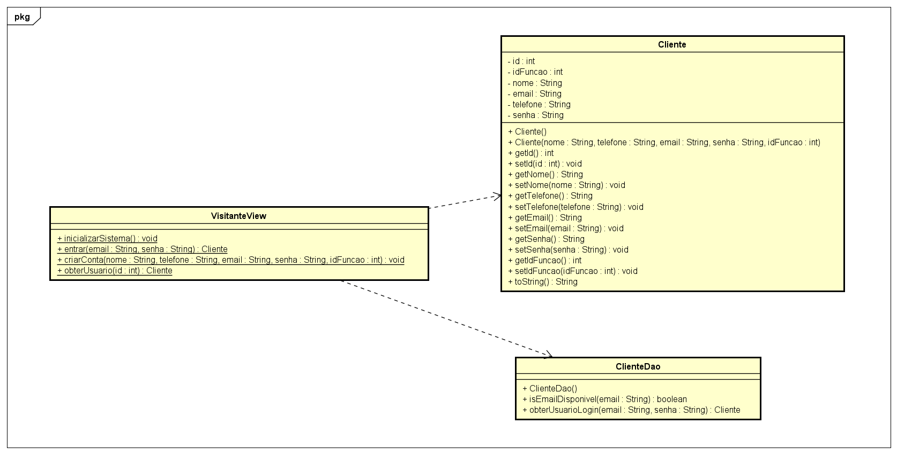
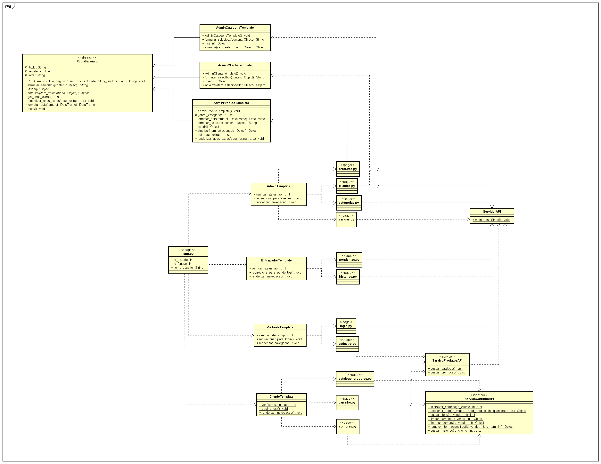

# 🛒 Mercadinho Caju - Sistema de Comércio Eletrônico

Este é um Sistema de Comércio Eletrônico completo, construído sob uma arquitetura **Cliente-Servidor**. O projeto deu um salto evolutivo de uma aplicação de console para um ecossistema web moderno, apresentando um **Back-end construído em Java (API REST com Javalin)** e um **Front-end reativo em Python (Streamlit)**.

O sistema foi projetado para gerenciar todas as etapas de um e-commerce real, isolando as regras de negócio da interface gráfica e provendo uma experiência de uso para três perfis distintos: **Administradores**, **Clientes** e **Entregadores**.

## ✨ Funcionalidades Principais

**Painel do Administrador (Gestão & ERP):**
* **Gestão Completa (CRUD):** Controle total sobre Clientes, Categorias e Produtos.
* **Promoções e Reajustes:** Sistema de agendamento de promoções (com % de desconto em categorias específicas) e ferramenta para aplicação de reajustes permanentes em lote.
* **Logística e Vendas:** Emissão de relatórios filtrados por período, auditoria de todos os itens comercializados e sistema de alocação de pedidos para entregadores disponíveis.

**Área do Cliente (E-commerce):**
* **Vitrine Virtual:** Catálogo dinâmico de produtos com cálculo de descontos promocionais em tempo real (estilo e-commerce).
* **Carrinho Inteligente:** Agrupamento de itens com sincronização em banco de dados, permitindo adicionar, remover e calcular totais antes do checkout.
* **Histórico e Rastreamento:** Consulta de pedidos anteriores, exibindo em qual estágio logístico a compra se encontra (Aguardando, Em Rota ou Entregue).

**Aplicativo do Entregador (Logística):**
* **Rotas Pendentes:** Visualização cronológica de pedidos alocados ao entregador logado (Status: `EM_ROTA`).
* **Confirmação de Entrega:** Botão de ação direta para dar baixa em encomendas concluídas (Status: `ENTREGUE`).
* **Histórico de Trabalho:** Registro completo das corridas finalizadas pelo profissional.

## 🏗️ Arquitetura do Sistema (API RESTful + UI Web)

O projeto abandonou o acoplamento tradicional para adotar uma arquitetura de microsserviços distribuídos:

1. **Back-end (Java API):** Responsável exclusivo pelas regras de negócio e persistência. Ele recebe requisições HTTP, valida os dados através de controladores, delega a lógica para a camada de serviços (Views/Services) e persiste as informações em arquivos JSON através dos DAOs. Toda a comunicação externa é feita via JSON.
2. **Front-end (Python Streamlit):** O cliente web. Sem conexão direta ao banco de dados, ele funciona consumindo a API Java através de requisições HTTP (`requests`). Utiliza o `st.session_state` para gerenciar sessões ativas (Login e ID do Carrinho) e renderiza interfaces ricas em HTML/CSS encapsuladas em Python.

### Diagrama de Pacotes Geral


## 📊 Diagramas UML Técnicos

Abaixo estão os mapeamentos técnicos e documentações do projeto, modelados no Astah.

### 1. Casos de Uso
Mapeamento das interações dos diferentes atores com o sistema.


### 2. Diagrama de Domínio (Entidades)
Regras estruturais e relacionamento entre objetos.


### 3. Camada de Persistência (DAO)
Manipulação atômica dos dados em arquivos JSON.


### 4. Arquitetura de Controladores (API REST)
Portas de entrada HTTP do Javalin recebendo requisições.


### 5. Camada de Serviços / Lógica de Negócio (Java)
Processamento das validações do sistema separadas por atores.
* **Admin:** 
* **Cliente:** 
* **Visitante (Auth):** 

### 6. Arquitetura Front-end (Streamlit UI)
Roteamento, componentização OO e abstração das chamadas de API no Python.


## 🚀 Tecnologias Utilizadas

**Back-end:**
* **Java (JDK 21+)**: Linguagem central da API.
* **Javalin**: Framework web super leve para construção dos endpoints REST.
* **Jackson (JavalinJackson)**: Serialização avançada de JSON, essencial para manipulação de atributos temporais (`LocalDateTime`).

**Front-end:**
* **Python 3**: Linguagem base do cliente.
* **Streamlit**: Framework reativo para construção rápida de interfaces web.
* **Requests & Pandas**: Comunicação HTTP com a API Java e formatação de dados matriciais (tabelas).

## 🛠️ Como Executar o Projeto

Para rodar a aplicação, você precisará inicializar as duas pontas do sistema separadamente.

**Passo 1: Inicializando o Servidor Java (API)**
1. Importe o projeto Java na sua IDE de preferência.
2. Certifique-se de que as dependências do `Javalin` e `Jackson` estão configuradas no seu `pom.xml` ou adicionadas ao classpath.
3. Execute o arquivo `ServidorAPI.java`. O console exibirá: `Servidor iniciado com sucesso na porta 8080!`.

**Passo 2: Inicializando o Cliente Web (Streamlit)**
1. Certifique-se de ter o Python e o `pip` instalados.
2. Abra o terminal na raiz da pasta do front-end e instale as dependências:
   ```bash
   pip install streamlit requests pandas
3. Inicie o sistema web rodando: streamlit run app.py
4. O navegador abrirá automaticamente na página de Login. Credenciais padrão do mestre: Email admin, Senha admin

## 👨‍💻 Autores e Contexto

Desenvolvido por **Maxwell Dantas** e **Cazuí Souto**, estudante de Análise e Desenvolvimento de Sistemas no IFRN (Campus Natal Central, RN).

Este projeto foi construído sob a orientação do **Prof. Gilbert Azevedo da Silva** na disciplina de Programação Orientada a Objetos. O objetivo principal foi aplicar padrões de projeto robustos e garantir a integridade de dados em sistemas complexos.
