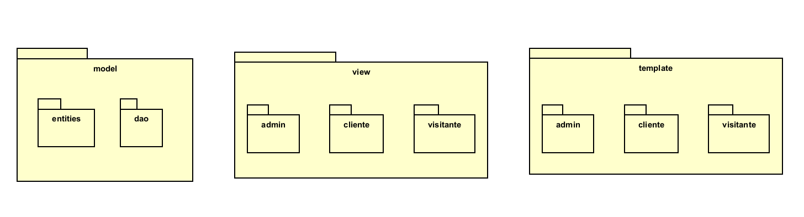
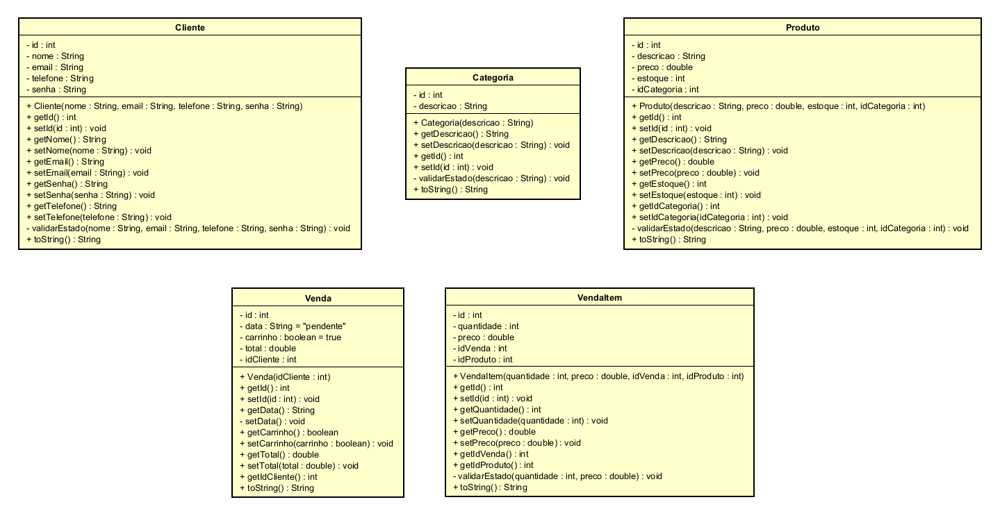
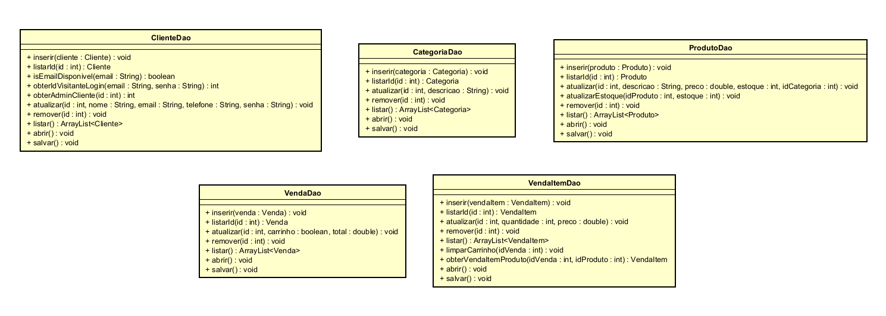
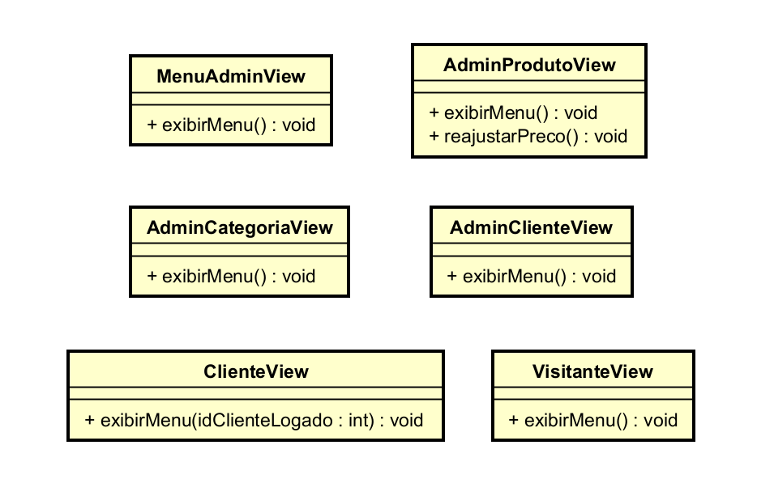
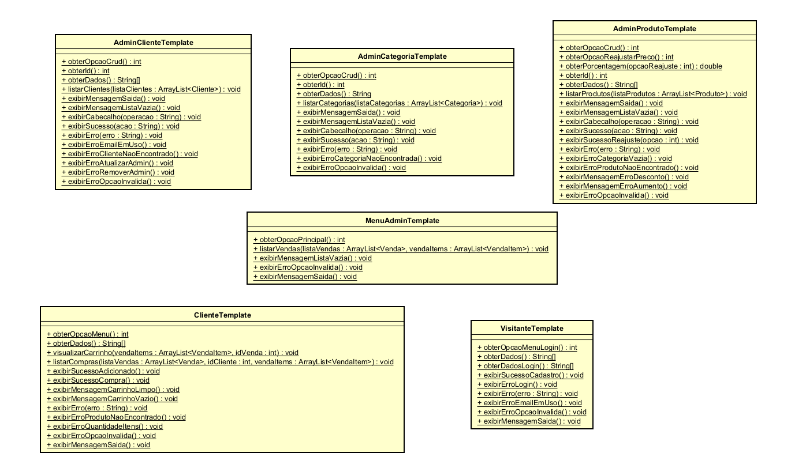

# 🛒 Sistema de Comércio Eletrônico - Java Console App

Este é um Sistema de Comércio Eletrônico desenvolvido em Java. A aplicação funciona inteiramente via terminal (console) e implementa uma separação clara de responsabilidades através de uma arquitetura baseada em camadas, garantindo código limpo, manutenibilidade e persistência de dados utilizando arquivos JSON.

O sistema foi projetado para atender a dois perfis distintos de usuários: **Administradores** e **Clientes**, cada um com seus respectivos menus e permissões de acesso.

## ✨ Funcionalidades Principais

**Visitantes e Segurança:**
* Criação de conta para novos clientes.
* Autenticação de usuários (Login).
* Geração automática (Bootstrap) do usuário Administrador mestre na primeira execução do sistema.
* Validação rigorosa de dados (*Fail-Fast*) nas Entidades, impedindo instâncias inválidas (ex: estoque negativo, e-mail duplicado).

**Painel do Administrador:**
* CRUD completo (Listar, Inserir, Atualizar, Remover) para Clientes, Categorias e Produtos.
* Ferramenta de reajuste de preços em lote (Aumentos e Descontos percentuais para todos os produtos).
* Visão global para listar as compras de todos os clientes da loja.

**Área do Cliente:**
* Visualização da vitrine de produtos disponíveis.
* Sistema inteligente de Carrinho de Compras, que agrupa quantidades de um mesmo produto.
* Controle de sessão: carrinhos abandonados são limpos automaticamente para evitar lixo no banco de dados.
* Opção de finalizar a compra, debitando automaticamente os itens do estoque e gerando a nota fiscal.
* Acesso ao histórico pessoal detalhado de compras finalizadas.

## 🏗️ Arquitetura do Sistema (MVT)

O projeto foi estruturado seguindo uma adaptação do padrão **Model-View-Template**, isolando a regra de negócio, o roteamento e a interface de texto.



A arquitetura está dividida em:
1. **Model (Entities & DAO):** Contém as classes estruturais do sistema (Cliente, Categoria, Produto, Venda, VendaItem) e as classes de Persistência (Data Access Object), responsáveis por ler e gravar os dados nos arquivos JSON utilizando a biblioteca Google GSON.
2. **Template:** Camada de visualização *stateless*. Responsável exclusivamente por desenhar os menus na tela, solicitar inputs do usuário e exibir mensagens de erro/sucesso.
3. **View:** Camada controladora. Faz o roteamento lógico, conecta os inputs recebidos do Template com as regras de negócio do DAO e gerencia as sessões dos usuários.

## 📊 Diagramas de Classes

### Entidades do Banco de Dados


### Camada de Persistência (DAO)


### Camada de Roteamento (View)


### Camada de Interface (Template)


## 🚀 Tecnologias Utilizadas

* **Java (JDK 21+)**: Linguagem principal do projeto.
* **Google GSON**: Biblioteca utilizada para a serialização e desserialização de objetos Java para arquivos JSON de forma atômica.
* **Git & GitHub**: Versionamento de código.

## 🛠️ Como Executar o Projeto

1. Clone este repositório em sua máquina local:
   ```bash
   git clone https://github.com/maxwell-dantas/comercio-eletronico.git
   ```

2. Abra o projeto em sua IDE preferida (IntelliJ IDEA, Eclipse, VS Code).
3. Certifique-se de adicionar a biblioteca **GSON** ao `classpath` do seu projeto.
4. Execute a classe principal `Main.java` localizada no pacote `comercioEletronico`.
5. **Nota:** Na primeira execução, o sistema criará automaticamente a pasta `data` com os arquivos JSON na raiz de `src/comercioEletronico/` e criará um usuário de acesso com as credenciais `admin` / `admin`.

## 👨‍💻 Autor e Contexto

Desenvolvido por **Maxwell Dantas**, estudante de Análise e Desenvolvimento de Sistemas no IFRN (Campus Natal Central, RN).

Este projeto foi construído como parte prática da disciplina de Programação Orientada a Objetos, sob a orientação do **Prof. Gilbert Azevedo da Silva**. O foco principal foi dominar o controle de estado de objetos, persistência de dados não-relacionais, e os fundamentos de código limpo em arquiteturas robustas.
